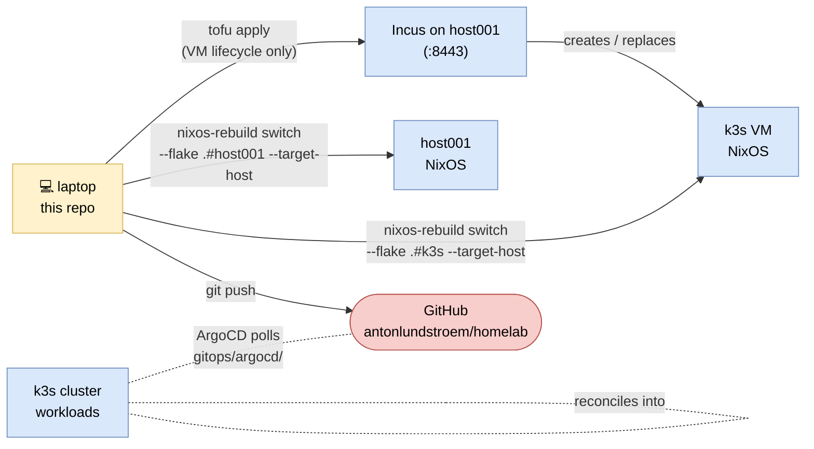
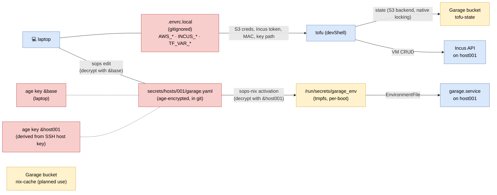

# Architecture

Visual map of the homelab. Source of truth is the code under `nixos/`, `terraform/`, `gitops/` — when those change in a way that moves a box or an arrow, update this doc in the same change. See `CLAUDE.md` for the *why* (ownership boundaries, GitOps bootstrap, secrets model); this file is the *what* and *where*.

Diagrams use Mermaid so they render inline on GitHub and stay diff-able.

## 1. Physical & service topology

What runs where. Outer box is the only physical machine (`host001`); the k3s VM is an Incus guest sitting on the LAN bridge alongside `host001` itself; cluster workloads run inside that VM.

```mermaid
flowchart TB
  classDef hw fill:#fff2cc,stroke:#d6b656,color:#000
  classDef svc fill:#dae8fc,stroke:#6c8ebf,color:#000
  classDef vm fill:#d5e8d4,stroke:#82b366,color:#000
  classDef k8s fill:#e1d5e7,stroke:#9673a6,color:#000

  subgraph host001["host001 · NixOS baremetal · Intel x86_64 · NVMe 128 GB"]
    direction TB

    zfs[("ZFS rpool<br/>root · nix · home · var-log · incus")]:::hw

    subgraph hsvc["systemd services on host001"]
      direction LR
      incusd["incus<br/>:8443 (UI/API)"]:::svc
      garage["garage<br/>:3900 S3 · :3902 web · :3903 admin<br/>buckets: nix-cache, tofu-state"]:::svc
      sopsnix["sops-nix<br/>activation-time decrypt"]:::svc
      sshd["sshd<br/>admin@ + key auth"]:::svc
    end

    subgraph net["networking"]
      direction LR
      enp["enp0s31f6<br/>(physical NIC)"]:::hw
      br0(("br0<br/>LAN bridge — DHCP"))
      incusbr0(("incusbr0<br/>10.0.100.0/24 · NAT<br/>(default Incus profile)"))
    end

    subgraph k3svm["k3s VM · Incus guest · 4 vCPU / 6 GiB · static IP on br0 (lan profile)"]
      direction TB
      k3sd["k3s server<br/>:6443 · traefik disabled"]:::vm

      subgraph cluster["k3s cluster (in-VM)"]
        direction TB
        ingress["ingress-nginx<br/>:80 / :443 · default class<br/>(HelmChart, auto-deploy)"]:::k8s
        argo["argo-cd<br/>argocd.lan<br/>(HelmChart, auto-deploy)"]:::k8s
        rootapp[/"Application: root<br/>→ gitops/argocd/ (recurse)"/]:::k8s
        haapp[/"Application: homeassistant<br/>→ gitops/manifests/homeassistant/"/]:::k8s
        ha["homeassistant · :8123<br/>homeassistant.lan<br/>PVC 10 Gi (local-path)"]:::k8s
      end
    end
  end

  enp --- br0
  br0 --- k3svm
  incusd -.- incusbr0
  zfs -.- incusd
  zfs -.- garage

  rootapp -. spawns .-> haapp
  haapp -. spawns .-> ha
  ingress -. routes argocd.lan .-> argo
  ingress -. routes homeassistant.lan .-> ha
```

Notes:
- The k3s VM uses Incus profiles `["default", "lan"]`. The `default` profile contributes the root disk on the ZFS-backed Incus pool; the `lan` profile overrides `eth0` to a bridged NIC on `br0`, so the VM gets a LAN IP rather than the NATed `10.0.100.0/24`.
- `incusbr0` is unused today — drawn for completeness because it'd be the path for any future NATed guest.
- `argocd.lan` and `homeassistant.lan` resolve outside this diagram (LAN DNS / hosts file).

## 2. Deploy flows

Who pushes what, and through which tool. The three lanes correspond to the three ownership boundaries in `CLAUDE.md` (Terraform / NixOS / ArgoCD).



Three rules to remember:
- **Terraform** is invoked only when something Terraform owns changes (VM cores/memory/network) or the VM is unrecoverable. Day-to-day OS changes use `nixos-rebuild`.
- **`nixos-rebuild`** runs from the laptop with `--target-host` — never wrapped in local `sudo` (see `CLAUDE.md`).
- **ArgoCD** owns everything in `gitops/` once the VM is up. Adding a workload is: drop manifests under `gitops/manifests/<x>/`, add `gitops/argocd/<x>.yaml`, commit — no rebuild.

## 3. Secrets & state

How encrypted material moves from the repo to the running services, and where state lives.



Notes:
- `.envrc.local` never leaves the laptop. `secrets/hosts/001/*.yaml` *is* committed but only the two age keys in `.sops.yaml` can decrypt it.
- The `&host001` age key is derived from `/etc/ssh/ssh_host_ed25519_key` via `ssh-to-age` — wiping host001 without preserving that key means re-running `sops updatekeys` from the laptop. See `secrets/hosts/001/` and the "Reinstall hazard" note in `CLAUDE.md`.
- Terraform state lives in Garage *on host001*, which is itself provisioned by NixOS on host001 — the bootstrap order is "host001 NixOS first, then `tofu init` can talk to its backend".
